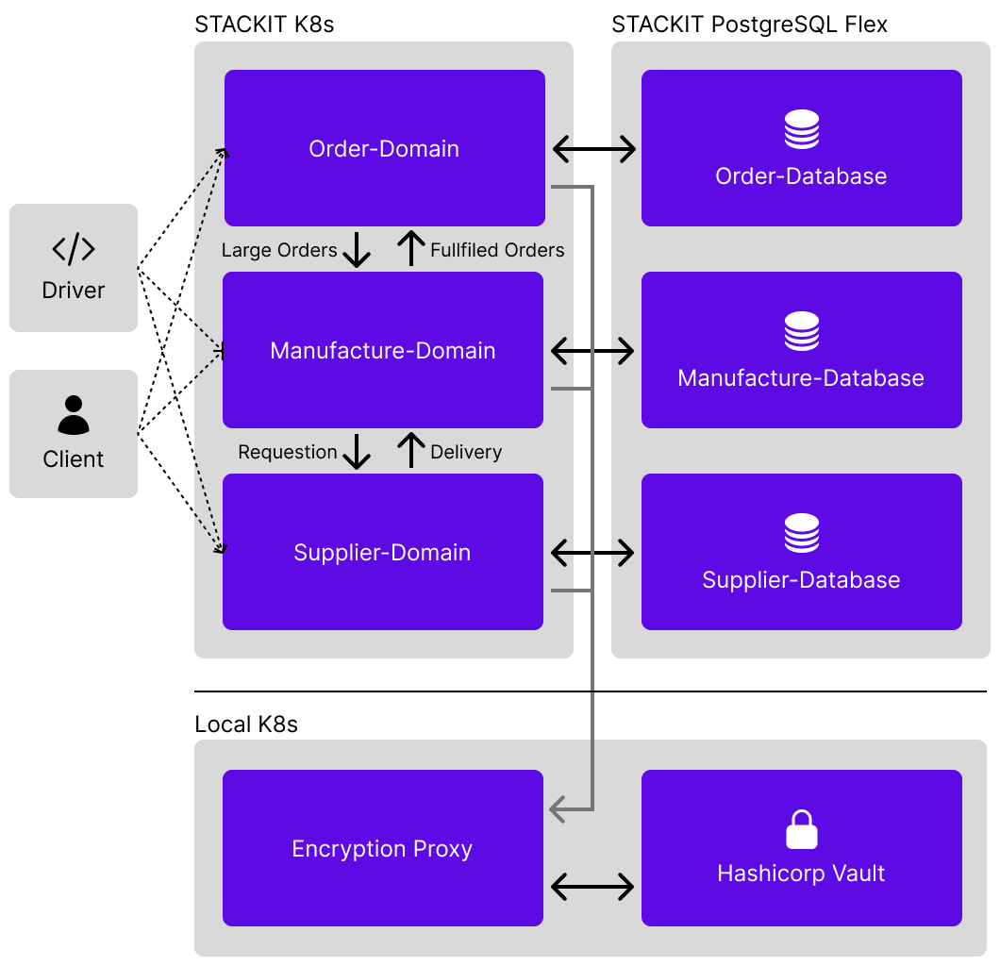

# Cloud-sovereignty showcase Hashicorp Vault

This terraform script deploys the cloudsovereignty showcase with column-level-encryption using keys from a HYOK-simulation.

It should demonstrate how HYOK could work but to make it easier to run it runs two K8s clusters on STACKIT.
The first cluster hosts the applications like in the ``stackit-kms`` example.
The second cluster hosts only a single Hashicorp Vault instance where the first one sends its requests for en- and decryption to.

Run the following commands to start everything up:

1. Configure your STACKIT service account (`sa-key.json` in the root folder of this repository).

2. Switch to the `infrastructure` folder to initialize the infrastructure

3. Run `terraform init` to initialize the workspace.
4. Run `terraform apply` to provision the infrastructure.

5. Switch to the `platform` folder to deploy the helm-charts to the cluster.

6. Run `terraform init` to initialize the workspace.
7. Run `terraform apply` to deploy the applications.

# Architecture

